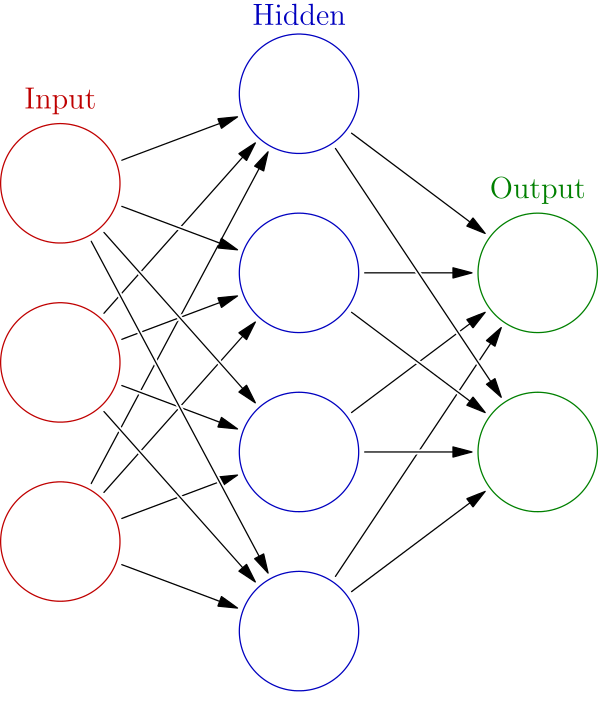
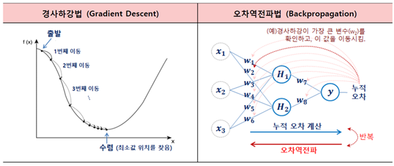

# machine learning

기계에게 데이터를 학습시키고, 데이터에 포함된 규칙성 or 패턴을 발견하게 하는 처리

  1) 기계에게 학습할 data를 input한다. 
  2) 사람이 특징량(이런 data의 특징을 수치화한 것)을 정의한다.
  3) 특징량을 기반으로 규칙과 패턴을 찾아 학습시킴
  
 ## 종류 
 
  - Supervised Learning (주로 예측)
    - 정답 data (목적 variable)를 input하면, 그것을 제외한 input을 기반으로 출력 결과가 최대한 정답 data에 가까워지도록 특징량을 추출하여 모델 구축
    - 훈련 데이터(Training Data)로부터 주어진 데이터에 대해 예측하고자 하는 값을 올바로 추측해내는 하나의 함수를 유추. 
    - decision tree, random forest, regression, logistic regression, artificial neural network(ANN), deep learning ...
    * 예시 : 고장날 기계 예측
    
  - Unsupervised Learning (주로 지식 발견)
    - 데이터가 어떻게 구성되었는지
    - 정답 data (목적 variable)가 포함되지 않음
    - coresspondense analysis, association analysis, network analysis, Principal component analysis(PCA) ...
    * 예시: clustering, 고객을 그룹으로 나누기
    
  
  
  
  
  
  
  
  
 ## Neural Network

 (사진 출처 : https://ko.wikipedia.org/wiki/%EC%9D%B8%EA%B3%B5_%EC%8B%A0%EA%B2%BD%EB%A7%9D)
 

 (사진 출처 : http://cs231n.github.io/neural-networks-1/)
 
    레이어의 종류는 input, hidden, output 이고  
    각 레이어에는 O 이라고 표현되는 node, - 라고 표현되는 edge(link)가 있으며 node를 연결한다.
    또한 edge에는 가중치(w)라는 값을 가지고 있다.
    이런 개념을 퍼셉트론 알고리즘(perceptron algorithm)이라고 한다.
    
    input -> output 의 방향으로 진행되는 것은 forward propagation(순전파),
    output -> input 의 방향으로 진행되는 것은 backward propagation(역전파).
 
 
 #### forward propagation(순전파)
 node의 값을 구하기 위해 앞단계의 node * w 의 sigma 를 활성화 함수로 변환한다.   
 활성화 함수의 종류는 레이어의 단계에 따라 달라진다. 구한 node의 값은 다음 단계의 node에 전해진다. 
  
  
  (사진 출처 : https://medium.com/@kmkgabia/ml-sigmoid-%EB%8C%80%EC%8B%A0-relu-%EC%83%81%ED%99%A9%EC%97%90-%EB%A7%9E%EB%8A%94-%ED%99%9C%EC%84%B1%ED%99%94-%ED%95%A8%EC%88%98-%EC%82%AC%EC%9A%A9%ED%95%98%EA%B8%B0-c65f620ad6fd)
 
 
 
 
 #### backward propagation(역전파)
 순전파 계산이 끝나고, output layer에서 구한 결과를 정답 data와 비교해 오차를 구한다.
 (이때 오차함수를 사용하는데, 분류일 때는 교차 엔트로피, regression에서는 제곱 오차를 사용.)
 이런 오차가 적어지도록(정답 data와 출력 data가 비슷해지도록) edge의 가중치를 조정. 
  
  
 (사진 출처 : https://m.blog.naver.com/PostView.nhn?blogId=drryuhk&logNo=220982055176&proxyReferer=https%3A%2F%2Fwww.google.com%2F)
 
  이렇게 오차가 낮은 지점을 찾아가는 경사하강법(좌/수치미분법)에서, 현재 위치에서의 오차함수를 미분한다.
  하지만 학습 계수 값이 너무 작거나 크면 (일반적인 기준 0.001 ~0.1) 학습에 오랜 시간이 걸리기도 함.
  
  
  + 학습하는 방법은 배치 학습, 미니배치 학습이 있다. 배치 학습은 가중치를 한번 업데이트를 할 때 모든 데이터를 사용하고, 미니배치 학습은 데이터를 여러갈래 나누어 한갈래씩 사용해 가중치를 업데이트한다. 전자의 경우 국소 최적해에 빠지는 경우가 많기 때문에 대부분 미니배치학습을 이용한다. (확률적 경사 하강법)
 
 
 
 
 
 
 ### 종류
 
 ####  artificial neural network, ANN
    - deep learning의 기반이 되는 기술로, 인간 뇌 신경 세포를 모방해 만든 수학적 모델.
 ####  deep neural network, DNN
 기존 신경망보다 더 많은 hidden layer를 갖는다.
 이미지 인식(MNIST, ILSVRC), 음성 인식(Baidu Deep Speech), 자동 번역(MNT), 사물검출(R-CNN), 이미지 생성(CDGAN), 자율주행(Segnet), 작곡(Kulita) 등등..
     * 종류
         - 모든 node가 결합한 전결합 신경망(Fully-connected Neural Network, FNN)
             -> 딥러닝의 기본적인 형태
         - 합성곱 레이어, 풀링 레이어가 추가된 합성곱신경망(CNN, Convolutional Neural Network)
             -> 피사체 인식에 많이 쓰임
         - 재귀 신경망(recursive neural network)
             -> 텍스트나 음성 data에 
         
  ###### Pre-Training
  layer가 깊어질수록 failure of gradient의 확률이 높아지기 때문에, 사전학습을 진행.
  자기 자신을 재현하여 정답 data로 만들어 학습하는 방법 (AE)
  - Auto Encoder (AE), Restricted Boltzman Machine (RBM)
  
  
